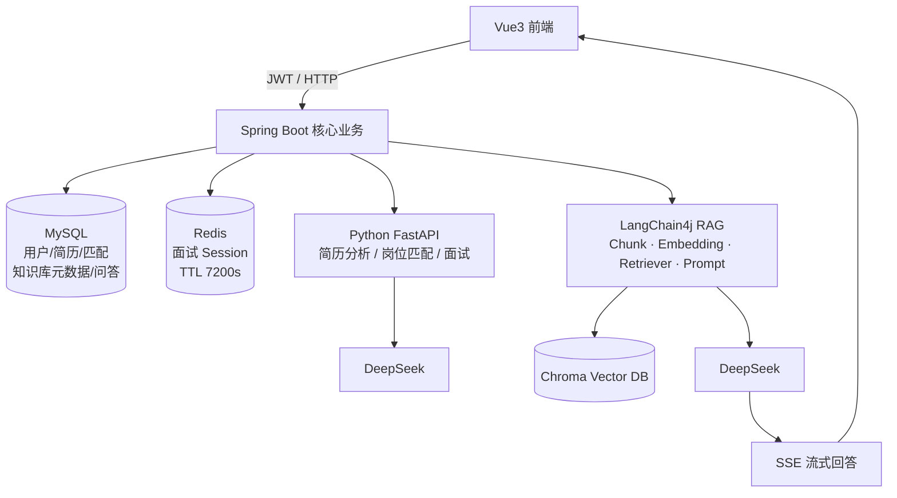
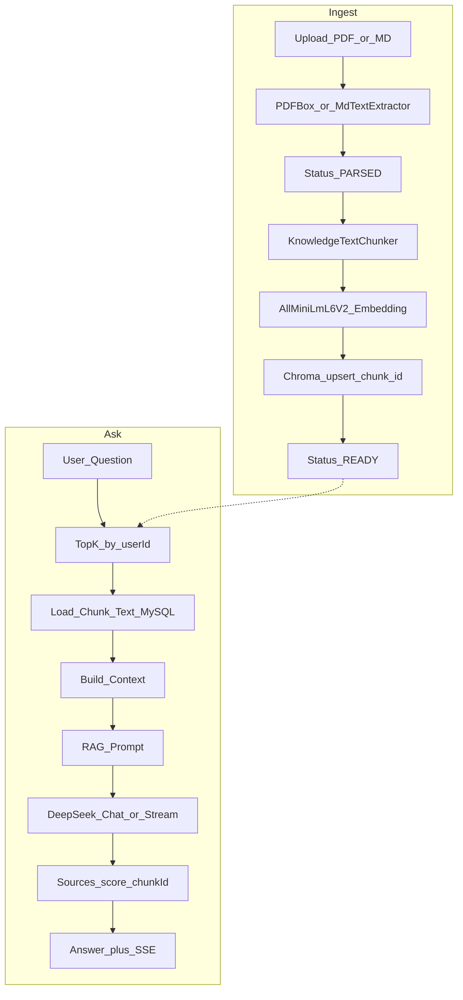

# AI Intelligent Job Hunting

面向 **Java 后端求职** 场景的 AI 求职平台：JWT 认证、简历分析、岗位匹配、AI 模拟面试，以及基于 LangChain4j 的 **RAG 知识库**（PDF / Markdown → Embedding → Chroma → DeepSeek → Sources / SSE）。

> **定位：** Spring Boot 做业务与 AI 主体；Python FastAPI 仅承载简历分析 / 岗位匹配 / 面试对话等能力，不负责 RAG 主链路。

---

## 技术亮点

```text
AI Job Platform
│
├── 用户认证 JWT
├── 简历解析 + AI 分析
├── 岗位匹配
├── AI 模拟面试
│   ├── Redis Session（TTL 7200s + MySQL 降级）
│   ├── SSE Streaming
│   └── MySQL 持久化
│
└── RAG 知识库
    ├── PDF / Markdown
    ├── PDFBox / MdTextExtractor
    ├── LangChain4j
    ├── 本地 Embedding（AllMiniLmL6V2 · 384d）
    ├── Chroma（Docker）
    ├── Top-K Retrieval（document_id + user_id 隔离）
    ├── DeepSeek（Context 注入）
    ├── Sources 溯源
    └── SSE Streaming
```

---

## 系统架构

> **技术路线：** Java（Spring Boot + MySQL + Redis + LangChain4j + Chroma）是主线；Python FastAPI 只是简历分析 / 岗位匹配 / 面试对话的辅助 AI 服务。**不是** Python 主导、Java 只做转发。

### 图 1 · 总体架构



**分层职责**

| 组件 | 职责 |
|------|------|
| Vue3 | 登录、简历、匹配、面试、知识库文档 / RAG 问答 UI |
| Spring Boot | JWT 鉴权、业务编排、资源归属校验（越权 → 403）、RAG 主链路 |
| MySQL | 用户 / 简历 / 匹配 / 面试 / 知识库文档与 Chunk / QA 记录 |
| Redis | AI 面试临时 Session（TTL 7200s，可降级 MySQL） |
| Python FastAPI | 仅 DeepSeek 调用侧车：简历分析、岗位匹配、面试流式问答 |
| LangChain4j + Chroma | **Java 内**完成 Chunk / Embedding / Top-K / Prompt / Sources / SSE |

```text
                         Vue3 前端
                            │
                         JWT/HTTP
                            ↓
                  ┌──────────────────┐
                  │  Spring Boot     │
                  │  核心业务服务     │
                  └────────┬─────────┘
                           │
          ┌────────────────┼────────────────┐
          ↓                ↓                ↓
       MySQL             Redis          Python AI
   用户/简历/匹配      面试Session       FastAPI
   知识库元数据/问答                      DeepSeek
          │
          │ Knowledge RAG（同进程）
          ↓
   LangChain4j → Chroma → DeepSeek → SSE → Vue
```

### 图 2 · RAG 详细流程（上传入库 + 问答）



**入库：** PDF/MD → 解析 → Chunk（~700 / overlap ~100）→ 本地 Embedding（384d）→ Chroma（`chunk-{chunkId}`，metadata 含 `user_id` / `document_id`）→ `READY`

**问答：** Question → Top-K（用户隔离）→ MySQL 取全文 → Context → DeepSeek → Answer + Sources；流式走 `StreamingChatModel` + SSE（`meta` / `delta` / `done` / `error`）

Markdown 清洗：保留标题文字与代码正文；去掉 YAML frontmatter、链接/图片 URL、代码围栏与语言标记；MD 的 `pageCount` 为 `null`。

更完整的可打印版（含简历口述要点）见 [`docs/architecture.md`](docs/architecture.md)。

---

## 功能模块

| 模块 | 能力 | 关键技术 |
|------|------|----------|
| 认证 | 注册 / 登录 / JWT | Spring Security |
| 简历 | PDF 上传、PDFBox 解析、AI 分析落库 | PDFBox + FastAPI |
| 岗位匹配 | JD vs 简历对比、历史查询 | FastAPI + MySQL |
| AI 面试 | 多轮问答、会话缓存、流式输出、报告 | Redis TTL 7200s、SSE、MySQL |
| 知识库 RAG | PDF/MD 上传→解析→切分→向量入库→问答 | LangChain4j、Chroma、Sources、SSE |
| 权限 | 资源级隔离；越权统一 **HTTP 403** | ForbiddenException |
---

## 技术栈

| 层 | 技术 |
|----|------|
| 前端 | Vue 3、TypeScript、Vite、Element Plus |
| 后端 | Java 21、Spring Boot 3.5、MyBatis-Plus、Spring Security、JWT |
| 数据 | MySQL、Redis |
| AI（Java） | LangChain4j、DeepSeek（OpenAI 兼容）、本地 Embedding、Chroma |
| AI（Python） | FastAPI、DeepSeek（简历 / 匹配 / 面试） |
| 基础设施 | Docker Compose（MySQL + Redis + Chroma） |

---

## 仓库结构

```text
AI-Intelligent-Job-Hunting/
├── docker-compose.yml       # MySQL + Redis + Chroma
├── scripts/start-infra.cmd  # Windows 一键起基础设施
├── docs/architecture.md     # 架构图说明
├── ai-job-web/              # Vue3 前端
├── ai-job-server/           # Spring Boot 主服务（含 RAG）
│   ├── docker-compose.chroma.yml  # 仅 Chroma（可选）
│   ├── sql/                 # 建表脚本（Compose 首次自动导入）
│   └── src/
├── ai-python-service/       # FastAPI（简历/匹配/面试）
└── README.md
```

---

## 快速启动

> **基础设施（推荐）：** 仓库根目录 `docker compose up -d` 一次性启动 **MySQL + Redis + Chroma**。  
> Spring Boot / Python / Vue 仍本机运行（降低全量容器化复杂度）。

### 0. 前置

- JDK 21、Maven、Node.js 18+、Python 3.10+、Docker Desktop
- DeepSeek API Key
- 若本机已占用 `3306` / `6379` / `8000`，请先停止本机 MySQL / Redis / 旧 Chroma

### 1. 启动基础设施

```bash
# 仓库根目录
docker compose up -d
docker compose ps
# Windows 也可：scripts\start-infra.cmd
```

| 服务 | 地址 | 说明 |
|------|------|------|
| MySQL | `127.0.0.1:3306` | 用户 `root` / 密码 `root`，库 `ai_job_platform`（首次自动执行 `ai-job-server/sql/*`） |
| Redis | `127.0.0.1:6379` | AOF 持久化 |
| Chroma | `http://127.0.0.1:8000` | 向量库（与 `application.yml` 默认一致） |

仅需 Chroma 时仍可用：`ai-job-server/docker-compose.chroma.yml`。

### 2. 配置密钥

```bash
# ai-python-service/.env（可参考 .env.example）
DEEPSEEK_API_KEY=你的密钥
DEEPSEEK_MODEL=deepseek-v4-flash
```

Spring Boot 通过**同名环境变量**读取 `DEEPSEEK_API_KEY`（不要写进仓库配置文件）。

### 3. 启动 Python AI 服务

```bash
cd ai-python-service
python -m venv venv
# Windows: venv\Scripts\activate
pip install -r requirements.txt
uvicorn main:app --host 0.0.0.0 --port 8001 --reload
```

### 4. 启动 Spring Boot

```bash
cd ai-job-server
# 确保进程环境已注入 DEEPSEEK_API_KEY
mvn spring-boot:run
# 或 java -jar target/ai-job-server-0.0.1-SNAPSHOT.jar
```

默认：`http://127.0.0.1:8080`（已对接 Compose 的 MySQL / Redis / Chroma）

### 5. 启动前端

```bash
cd ai-job-web
npm install
npm run dev
```

默认：`http://127.0.0.1:5173`

---

## 核心演示路径（验收）

1. 注册 / 登录（JWT）
2. 上传简历 → AI 分析
3. 输入 JD → 岗位匹配
4. 开始 AI 面试 → Redis Session → SSE 流式回答 → 面试报告
5. 知识库上传 **PDF / Markdown** → 解析 `PARSED` → 向量入库 `READY`
6. RAG 提问 → 中文 Answer + Sources（可走 SSE）
7. 用户 B 访问用户 A 资源 → **HTTP 403**

建议验证问题（知识库已喂入 Java 后端面试向资料时）：HashMap、ConcurrentHashMap、JVM、Spring Boot、MySQL、Redis。

### 最终 E2E 脚本（MD + RAG + SSE + 403）

前置：Spring Boot `:8080`、Chroma `:8000`、DeepSeek Key 已配置。

```bash
python ai-job-server/scripts/e2e_final.py
```

验收点：上传 MD → PARSED → ingest READY → Top-K → sync ask（Sources + `qaId`）→ SSE（`meta`/`delta`/`done`）→ 用户 B 隔离 / `documentId` 越权 **403**。报告输出到 `ai-job-server/scripts/e2e_final_report.txt`。

---

## API 速览（知识库）

| 方法 | 路径 | 说明 |
|------|------|------|
| POST | `/api/knowledge/documents` | 上传 PDF / MD（自动解析） |
| POST | `/api/knowledge/documents/{id}/ingest` | Chunk + Embedding + 写入 Chroma |
| POST | `/api/knowledge/ai/ask` | 同步 RAG 问答 |
| POST | `/api/knowledge/ai/ask/stream` | SSE 流式 RAG（`meta` / `delta` / `done` / `error`） |
| POST | `/api/knowledge/ai/retrieve` | 仅 Top-K 检索 |

更多示例见 [`ai-job-server/test.http`](ai-job-server/test.http)。

---


---

## License

本仓库代码用于学习。第三方知识资料（如 JavaGuide）请遵循其原仓库许可，勿直接提交进 Git。
