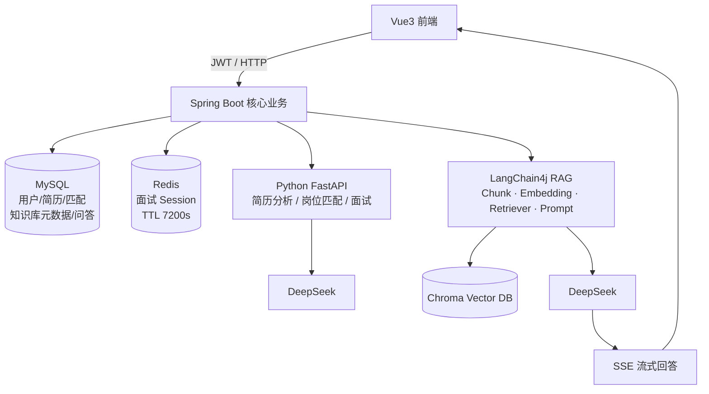
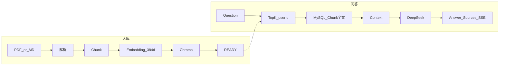

# 架构说明（可放简历 / GitHub）

本文与根目录 [README.md](../README.md) 配套：**图 1 总架构**强调 Java 主线；**图 2 RAG 流程**强调入库与问答两条链。

---

## 图 1 · 总体架构



### 文本版（方便贴简历）

```text
                         Vue3 前端
                            │
                         JWT/HTTP
                            ↓
                  ┌──────────────────┐
                  │  Spring Boot     │
                  │  核心业务服务     │
                  └────────┬─────────┘
                           │
          ┌────────────────┼────────────────┐
          ↓                ↓                ↓
       MySQL             Redis          Python AI
   用户/简历/匹配      面试Session       FastAPI
   知识库/问答                         DeepSeek
          │
          │ Knowledge RAG（Java 同进程）
          ↓
   ┌──────────────────────┐
   │ LangChain4j          │
   │ Chunk / Embedding    │
   │ Retriever / Prompt   │
   └──────────┬───────────┘
              ↓
       Chroma Vector DB
              │
              ↓
       Top-K + Sources
              │
              ↓
          DeepSeek
              │
              ↓
        SSE 流式回答 → Vue
```

### 为什么这样画（面试一句话）

- **Spring Boot** 是业务与 AI 编排中心：鉴权、持久化、RAG、权限 403。
- **Python** 是独立 AI 侧车，只服务简历 / 匹配 / 面试对话。
- **RAG 不在 Python**：Embedding、Chroma、RAG Prompt 全在 Java + LangChain4j。

---

## 图 2 · RAG 详细流程



### 文本版

```text
【入库】
PDF/MD → PDFBox / MdTextExtractor → PARSED
      → Chunk(~700, overlap~100)
      → Local Embedding(384d)
      → Chroma(chunk-{id}, user_id/document_id)
      → READY

【问答】
Question → Top-K（user 隔离）→ MySQL 取 Chunk 全文
        → Context 注入 Prompt → DeepSeek
        → Answer + Sources
        → 可选 SSE（meta / delta / done / error）
```

### 数据与隔离

| 存储 | 内容 | 隔离键 |
|------|------|--------|
| MySQL | 文档元数据、Chunk 全文、QA 记录 | `user_id` |
| Chroma | 向量 | metadata：`user_id` + `document_id` |
| 向量 ID | 稳定幂等 | `chunk-{chunkId}` |

重复 Ingest：先按 `document_id` + `user_id` 删除旧 Chunk / 向量，再写入。

---

## 与「错误讲法」的对比

| 错误印象 | 本项目实际 |
|----------|------------|
| Python 做全部 AI，Java 只调 HTTP | Java 做 RAG + 业务；Python 只做部分 DeepSeek 调用 |
| 向量库无隔离 | Chroma metadata + Service 层归属校验 + 403 |
| 只有同步问答 | 同步 `/ask` + SSE `/ask/stream` |
